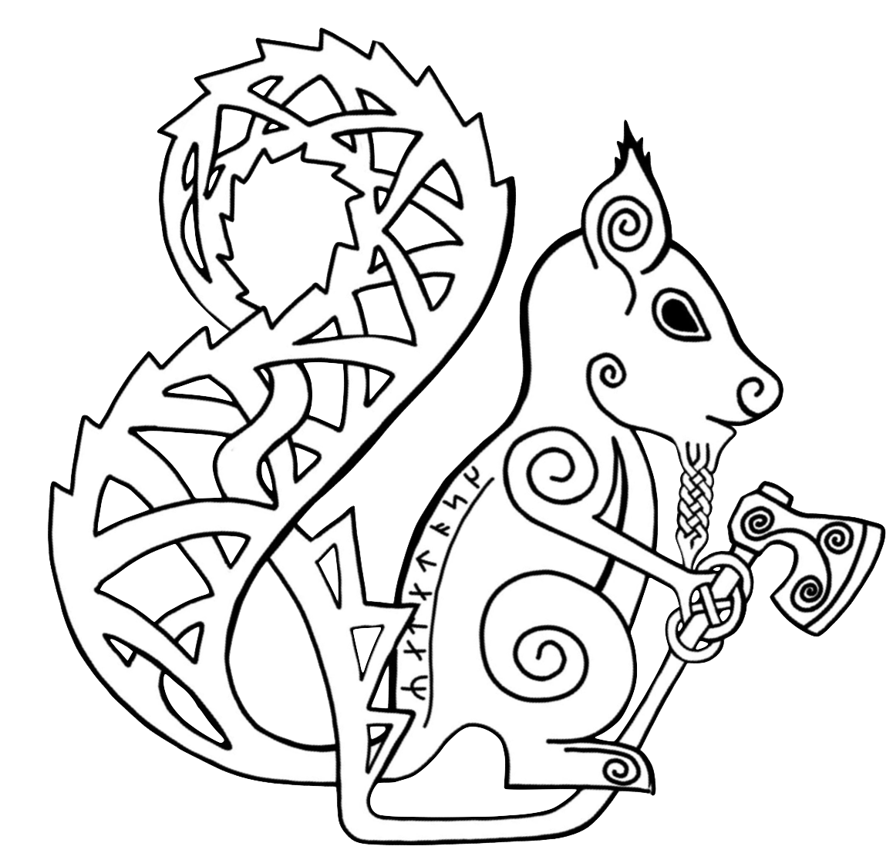

{ .hero-logo }

# Ratatöskr { .hero-title }

Wikingerzeit-Reenactment, lebendige Geschichte und ein kleines Museum —
drei Menschen, eine Leidenschaft für das frühe Mittelalter.
{ .hero-tagline }

[Über uns](ueber-uns.md){ .md-button .md-button--primary }
[Das Museum](museum.md){ .md-button }

## Wer sind wir?

-   :material-account-group:{ .lg .middle } &nbsp; **Eine Gruppe aus drei**

    ---

    Wir sind ein kleines, aber engagiertes Team, das die Lebenswelt der
    Wikingerzeit durch gründliche Recherche und handwerkliche Nacharbeit
    zum Leben erweckt.

-   :material-castle:{ .lg .middle } &nbsp; **Lebendige Geschichte**

    ---

    Auf Märkten, Museen und Schulveranstaltungen zeigen wir, wie Menschen
    im 9. bis 11. Jahrhundert lebten, arbeiteten und glaubten.

-   :material-home-city:{ .lg .middle } &nbsp; **Kleines Museum**

    ---

    Unsere Sammlung an Repliken, Originalen und Dokumenten ist bei uns
    vor Ort zu besichtigen — nach Absprache auch für Gruppen.

-   :material-book-open-variant:{ .lg .middle } &nbsp; **Wissenschaftlich fundiert**

    ---

    Hinter jedem nachgebauten Objekt stecken Quellenstudium und
    Fachliteratur. Wir erklären gerne, warum wir etwas so gemacht haben
    — und was wir noch nicht wissen.

## Ratatöskr — das Eichhörnchen

In der nordischen Mythologie läuft **Ratatöskr** den Weltenbaum Yggdrasil
auf und ab und trägt Botschaften zwischen dem Adler in den Wipfeln und der
Schlange in den Wurzeln.

Für uns steht dieser ruhelose Bote für unsere Überzeugung: Wissen verbindet
die Welten — Vergangenheit und Gegenwart, Forschung und Erlebnis,
Gelehrte und Neugierige.

> [!quote] Prosa-Edda, Gylfaginning
> „Ein Eichhörnchen heißt Ratatöskr, das läuft den Eschenbaum hinauf und
> hinab und trägt Fehdeworte zwischen dem Adler oben und Níðhöggr unten."
